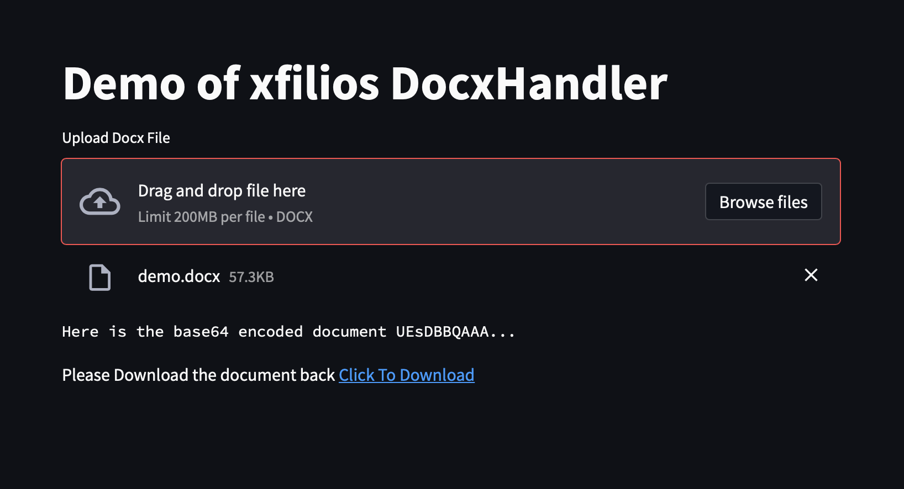
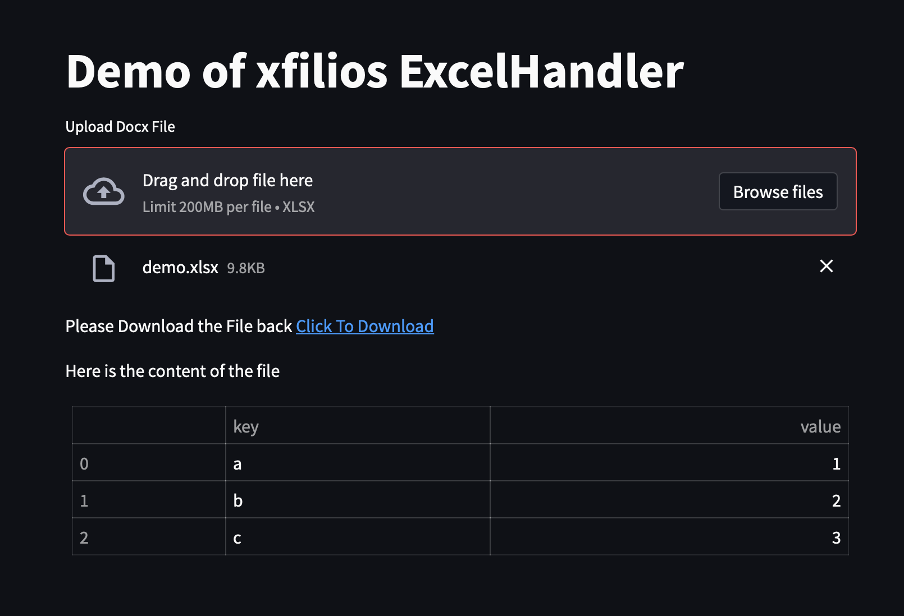

# Xfilios
Excel and Docx FileIO handlers in the client side for Streamlit (in future Dash will also be considered) Framework. The library provides easy to use classes to encode or decode Docx and Excel at the client side. The following core features are available in the library:
- Convert an uploaded Docx-file into base64 encoded string to send over HTTP post request (a wrapper over python-docx package)
- Convert Data received from an HTTP get/post request into Downloadable Excel file (a wrapper over pandas and openpyxl)
- Combine multiple data source into multi-sheet Downloadable Excel file at the frontend (a wrapper using pandas ReadExcel function with openpyxl)

This package is actually a wrapper over pandas and python-docx package. It is possible to extend other fileIO types like csv, text etc in further release.

## DocxHandler
When a Docx file is uploaded into streamlit, it consider the content as a file like object. The package `xfilios` provide a class called `DocxHandler` which has a class method can receive a file like object and will return a `DocxHandler` object. After create a handler object it easy to convert the content into base64 encoded string to send it over a Rest API as follows:
```python
import streamlit as st
from xfilios.docx import DocxHandler

def docx_handler_demo():
    st.title('Demo of xfilios DocxHandler')
    content = st.file_uploader("Upload Docx File", type="docx")
    if content:
        handler = DocxHandler.from_file_like(content)
        # Now you can send the encoded string over Http post request
        document_base_64 = handler.to_base64_str()
        # requests.post(body={"data": document_base_64})
        st.text("Here is the base64 encoded document {}...".format(document_base_64[:10]))

        # Or if you received a base64 encoded binary document you can create a downloadable link
        download_link = handler.create_download_link(filename="demo.docx")
        download_text = f"Please Download the document back {download_link}"
        st.markdown(download_text, unsafe_allow_html=True)
```



TableHandler and ExcelHandler
The TableHandler and ExcelHandler can work together to achieve the same functionality like `DocxHandler`. After you upload a Excel file you can use TableHandler to collect the content of the file. If you have multiple table you can load all the tables and wrap them with `TableHandler` and create a list of `TableHandler` and hand it over to `ExcelHandler`. `ExcelHandler` will finally create a downloadable Excel file where each table will an Excel sheet.

```python
import streamlit as st
from xfilios.table import TableHandler
from xfilios.excel import ExcelHandler

def excel_handler_demo():
    st.title('Demo of xfilios ExcelHandler')
    content = st.file_uploader("Upload Docx File", type="xlsx")
    if content:
        # Each table handler will consist one table
        table_handler = TableHandler.from_file_like(content)
        # You can put multiple table handler into a list [table_handler1, table_handler2 ...]
        excel_handlers = ExcelHandler([table_handler])
        download_link = excel_handlers.create_download_link(filename="demo.xlsx")
        download_text = f"Please Download the File back {download_link}"
        st.markdown(download_text, unsafe_allow_html=True)
        st.markdown("Here is the content of the file")
        st.table(table_handler.get_data_as_dataframe())
```

